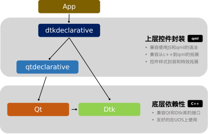

# dtkdeclarative

​dtkdeclarative 是基于 QtQuick/QtQml 实现的控件开发库，它是用于代替已有的 dtkwidget 编程而开发出来的一个全新的 DTK 模块。dtkclarative 代码以 qtdeclarative 为基础进行开发，实现了对QML已有控件的覆盖（包含Qt Quick Controls 2中的所有控件），并增加了大量在 DTK  环境下友好显示的视觉特效和颜色风格。相对于 dtkwidget，它具备以下特点：

1. **原始的 Qt 和 Qml 代码风格**
2. **适配传统 Qml 的所有 API**
3. **简单快速的界面开发接口**
4. **统一的控件主题风格**
5. **丰富的特效和色彩**



## 依赖

+ qml-module-qtquick-shapes
+ qml-module-qtquick-layouts

## 编译依赖

+ qtdeclarative5-dev
+ qtbase5-dev-tools,
+ qtquickcontrols2-5-dev
+ libdtkgui-dev
+ libdtkcore-dev
+ qtdeclarative5-private-dev
+ qtbase5-private-dev

## 安装

### 构建过程

1. 确保所有依赖安装完成
2. 执行源码编译指令

```shell
$ git clone https://github.com/linuxdeepin/dtkdeclarative.git
$ mkdir build
$ cd build
$ qmake ..
$ make
```

3. 安装

```shell
$ sudo make install
```

## 帮助

+ 遇到使用问题，可直接提出 issue
+ 在 [Deepin社区](https://bbs.deepin.org/)寻求帮助

## 贡献指南

+ [开发者代码贡献指南](https://github.com/linuxdeepin/developer-center/wiki/Contribution-Guidelines-for-Developers)

## 许可

dtkdeclarative is licensed under the [LGPL-3.0-or-later](LICENSE)

## TODO

1. 添加 plugins.qmltypes 文件，支持代码补全
2. 支持 Qt6
3. 支持 Vulkan
