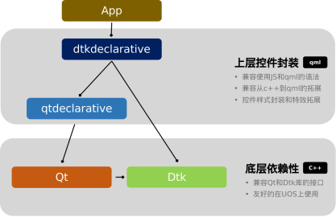

## 介绍

​		dtkdeclarative 是基于 QtQuick/QtQml 实现的控件开发库，它是用于代替已有的 dtkwidget 编程而开发出来的一个全新的 DTK 模块。dtkclarative 代码以 qtdeclarative 为基础进行开发，实现了对QML已有控件的覆盖（包含Qt Quick Controls 2中的所有控件），并增加了大量在 DTK  环境下友好显示的视觉特效和颜色风格。相对于 dtkwidget，它具备以下特点：

 1. **原始的 Qt 和 Qml 代码风格**

 2. **适配传统 Qml 的所有 API**

 3. **简单快速的界面开发接口**

 4. **统一的控件主题风格**

 5. **丰富的特效和色彩**

    

    

## 编译依赖

- qtdeclarative5-dev
- qtbase5-dev-tools,
- qtquickcontrols2-5-dev
- libdtkgui-dev
- libdtkcore-dev
- qtdeclarative5-private-dev
- qtbase5-private-dev

### 编译和安装

1. 确保所有依赖安装完成
2. 执行源码编译指令

```shell
$ mkdir build
$ cd build
$ qmake ..
$ make
```

3. 安装

```shell
$ sudo make install
```

## 运行依赖

+ qml-module-qtquick-shapes
+ qml-module-qtquick-layouts

## 获取帮助

1. 遇到使用问题，可直接提出 issue
2. 在 [Deepin](https://bbs.deepin.org/) 社区寻求帮助

## 许可

deepin-tool-kit is licensed under the LGPLv3 license.
